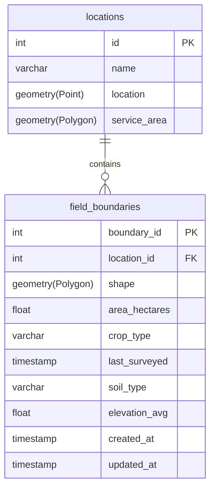

# etl_pipeline
A rough example of some geospatial ETL

On my machine locally, I have a postgresql database with a postgis extention with the following schema:


Eventually, the goal of this repo is to be an example pipeline getting data, transforming it, and loading it somewhere else
## Getting Started

### Prerequisites
- PostgreSQL with PostGIS extension
- Python 3.x
- `psycopg2` library for PostgreSQL connection
- `geopandas` for geospatial data manipulation
- `jupyter` for interactive data visualization

### Installation
1. Clone the repository:
    ```sh
    git clone https://github.com/yourusername/etl_pipeline.git
    cd etl_pipeline
    ```

2. Set up a virtual environment and activate it:
    ```sh
    python -m venv venv
    source venv/bin/activate  # On Windows use `venv\Scripts\activate`
    ```

3. Install the required Python packages:
    ```sh
    pip install -r requirements.txt
    ```

### Usage: under construction
1. Set up your PostgreSQL database with PostGIS extension and create the schema as described above.

2. Extract data from the NEON and open_topography datasets:
    ```sh
    python extract_data.py
    ```

3. Transform the data to be compatible with your database schema:
    ```sh
    python transform_data.py
    ```

4. Load the transformed data into your PostgreSQL database:
    ```sh
    python load_data.py
    ```

5. Perform spatial joins and other geospatial operations within the database.

6. Visualize the data using `geopandas` or `jupyter` notebooks:
    ```sh
    jupyter notebook
    ```

### Contributing
Contributions are welcome! Please open an issue or submit a pull request.

### License
This project is licensed under the MIT License - see the [LICENSE](LICENSE) file for details.

#### Brain dump:
General ideas:
Extract data from the NEON dataset and the open_topography dataset, 
Transform the data to be compatible to feed into a normal view for loading
Load data into the natcap model for an output.
    * maybe load model outputs into a database somewhere to train a machine learning model later on?
* create a postgressql database, with postGIS with it
* pull topo data and put it in the database,
* pull neon data and put it in a database
* do spatial join for an attribute table within the database
* some sort of viewer like geopandas or geojupyter
